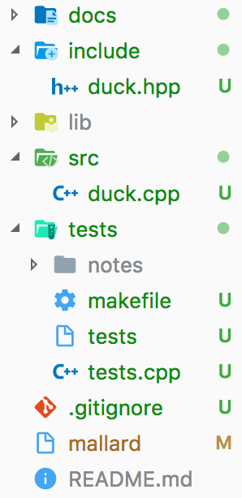
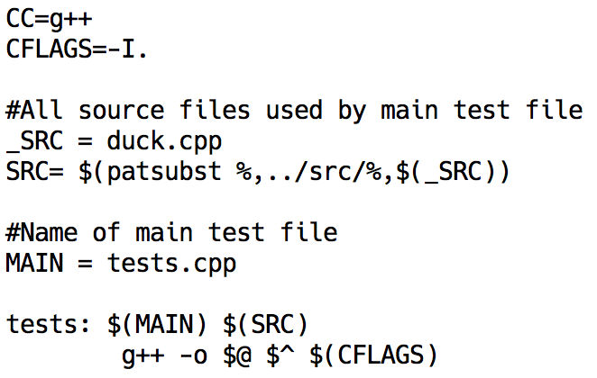
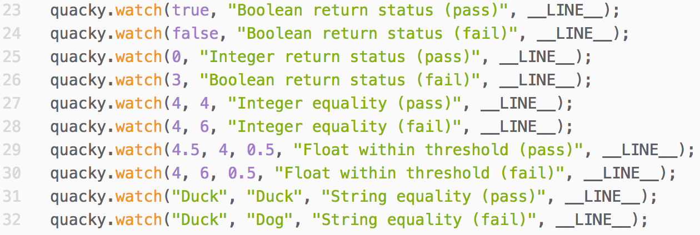

# Mallard

## A lightweight software testing framework

Designed as a lightweight solution to promote test-driven development, Mallard is an easy way to deploy unit testing on software for school projects and more!

## The rational

> Test-driven development guides your work towards an end goal while ensuring all previously achieved goals are still met

### Features

* Tell Mallard to watch your code at certain points to ensure your code works as expected!
* If specified, Mallard can provide runtime error reporting for your code and provides a detailed summary of your tests after your code's execution.
* Once your program has executed, Mallard will provide a customizable log file summarizing your the test's entire run.
* Mallard can be set up to track the best performing version of your code. You can rollback your code to the best performing version at any time!
* Mallard can also generate a time-series log file so you can track your code's performance over time

### Usage

In this document, any`duck.function()` represents a call made by a `Duck` object

#### Setup

By typing`./mallard init`, you can create a mallard project inside of an existing directory.

Just make sure to include a copy of `duck.hpp` and `duck.cpp` inside the `mallard_testing/include` and `mallard_testing/src` folders respectively.

Also be sure to include the names of your source files within the `SRC` variable of the `makefile` located in `mallard_testing`.

#### Writing tests

Tests are initiated by the `watch` function, they can be used to test for:

* String equality
* Integer equality
* Float equality
* Boolean return status
* Integer return status

sample usage: `duck.watch(authenticate(user, password), "valid", "Test for successful login", __LINE__);`

#### Running tests

By using the command `./mallard run` you can run all the tests stated within the `mallard_testing/tests.cpp` file. Any logs will be generated inside the `mallard_testing/mallard_notes` folder.

Adding a `duck.status()` breakpoint inside your code will output the status of that corresponding duck's tests so far.

Sample tests:

Status:

#### Logging

Logging is controlled in your code through the `duck.take_notes();` and the `duck.end_notes();` commands. Your log file can be customized to your liking though the following variables:

* `show_passes`
* `show_fails`
* `show_reason`

All of which are properties of every `Duck` instance.

#### Version control

When creating a `Duck` object, you must specify its name, but you can also include a specific file that it supervises. For example: `Duck bob("bob", "matrix.cpp");`

If you enable version control `bob.version_control = true;` the duck will keep track of the best performing version of the file it was assigned, `"matrix.cpp"`. The best performing version will be stored as `mallard_notes/bob_pick.cpp`

At any point, you can rollback the file to its best performing version through `./mallard rollback -duckname- -filename-`. In this case it would be `./mallard rollback bob matrix.cpp`. The file `"matrix.cpp"` will be updated to its best performing version.

#### License

[See LICENSE](docs/LICENSE.md)
